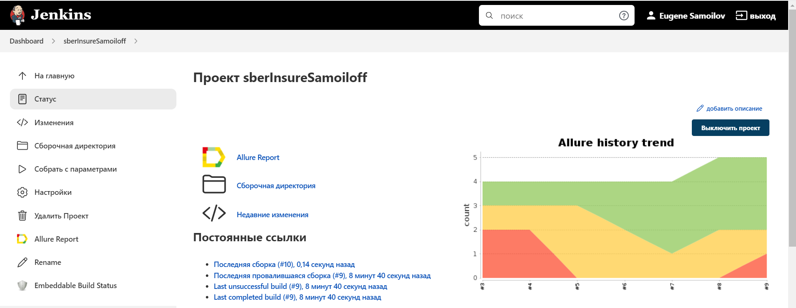
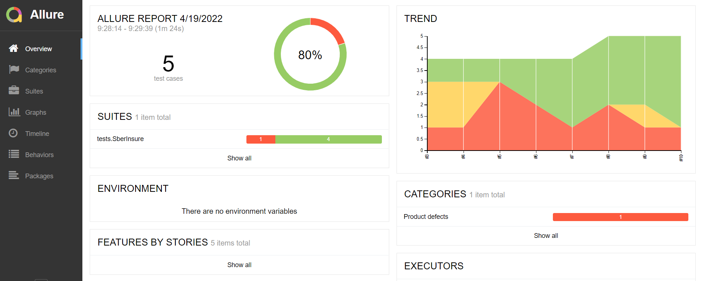
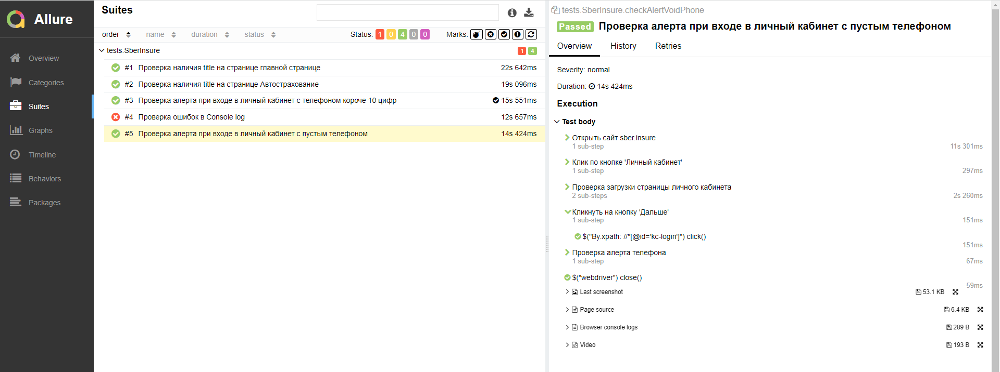
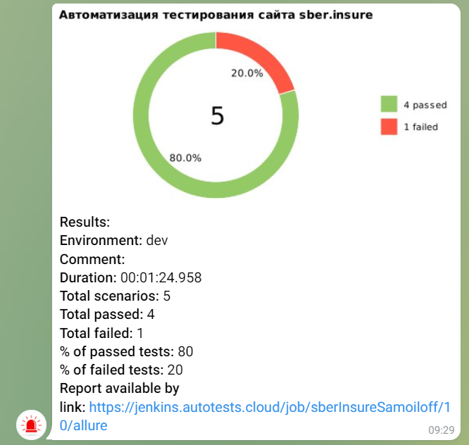
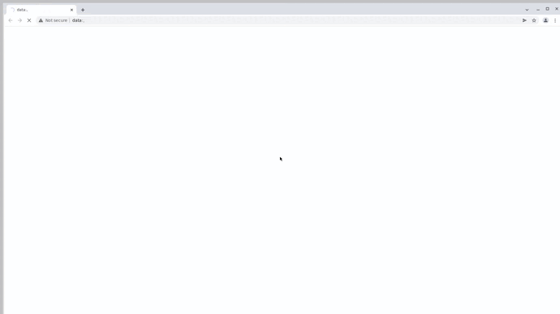

# Проект по автоматизации тестирования сайта Сбер Страхование
## <a target="_blank" href="https://sber.insure/">sber.insure</a>

## :floppy_disk: Содержание:

- <a href="#computer-технологии-и-инструменты">Технологии и инструменты</a>
- <a href="#notebook_with_decorative_cover-реализованные-проверки">Реализованные проверки</a>
- <a href="#electric_plug-сборка-в-Jenkins">Сборка в Jenkins</a>
- <a href="#arrow_forward-запуск-из-терминала">Запуск из терминала</a>
- <a href="#open_book-allure-отчет">Allure отчет</a>
- <a href="#robot-отчет-в-telegram">Отчет в Telegram</a>
- <a href="#film_projector-видео-примеры-прохождения-тестов">Видео примеры прохождения тестов</a>

## :computer: Технологии и инструменты
<p align="center">


</p>

## :notebook_with_decorative_cover: Реализованные проверки
- Проверка title на главной странице
- Проверка ошибок в Console log браузера
- Проверка title на странице "Автострахование"
- Проверка алерта при входе в личный кабинет с телефоном короче 10 цифр
- Проверка алерта при входе в личный кабинет с пустым телефоном

## :electric_plug: Сборка в Jenkins
### <a target="_blank" href="https://jenkins.autotests.cloud/job/sberInsureSamoiloff/">Сборка в Jenkins</a>
<p align="center">

</p>  

## :arrow_forward: Запуск из терминала
Локальный запуск:
```
gradle clean test
```

Удаленный запуск:
```
clean
test
-Dremote=${REMOTE}
-Dbrowser=${BROWSER}
-Dsize=${SIZE}
-Duser=${USER}
-Dpassword=${PASSWORD}
```

## :open_book: Allure отчет
- ### Главный экран отчета
<p align="center">

</p>

- ### Страница с проведенными тестами
<p align="center">

</p>

## :robot: Отчет в Telegram
<p align="center">

</p>

## :film_projector: Видео примеры прохождения тестов
> К каждому тесту в отчете прилагается видео. Одно из таких видео представлено ниже.
<p align="center">
  
</p>